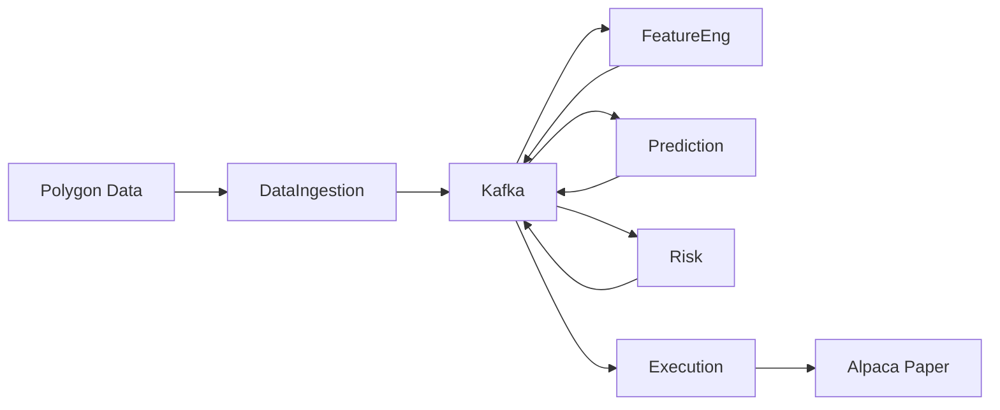

# AWET Next Steps - Roadmap to Production

> **Generated:** January 16, 2026  
> **Purpose:** Prioritized plan to finish AWET to production-quality

---

## Next Steps Runbook (Clean Start)

Run these commands in order:

1) Start infra
- docker compose up -d

2) Verify database schema
- python scripts/verify_db.py

3) Ingest synthetic market data (fast, no external APIs)
- python scripts/ingest_market_data.py --symbols AAPL --start 2024-01-01 --end 2024-01-03 --source synthetic

4) Run full E2E test (single button)
- python scripts/e2e_test.py
- pytest -m e2e -v

5) Run full pipeline (single command)
- python scripts/run_pipeline.py --symbols AAPL --start 2024-01-01 --end 2024-01-10 --train --paper --promote

2) Build universe (daily bars recommended for scale)
- make universe N=50 DAYS=60 MODE=daily
- make universe N=100 DAYS=60 MODE=daily
- make universe N=500 DAYS=180 MODE=daily
- make universe N=1000 DAYS=180 MODE=daily

3) Load market data
- make load-market-data

4) Build features
- make build-features

5) Train baseline (80/20 split)
- make train-baseline

6) Promote model to green
- python -m src.ml.train promote --auto

7) Start prediction agent (loads green model)
- python -m src.agents.time_series_prediction

8) Verify Reddit (ingest + join proof)
- make verify-reddit

9) Open portals
- make portals

---

## TraderDecisionAgent (Local)

Start infra (if not already running):
- docker compose up -d

Run the agent:
- python -m src.agents.trader_decision_agent

Health check:
- curl http://localhost:8011/health

Smoke test:
- python scripts/smoke_trader_decision.py

---

## BacktesterAgent (Local)

Start the agent:
- python -m src.agents.backtester_agent

Run smoke test:
- python scripts/smoke_backtest.py

Run CLI example:
- python scripts/run_backtest.py --symbols AAPL MSFT --start 2024-01-01 --end 2024-06-30 --initial-cash 2000

---

## Current Completion by Subsystem

| Subsystem | Completion | Status | Priority |
|-----------|------------|--------|----------|
| **Infrastructure** | 100% | ✅ Done | - |
| **Data Ingestion** | 95% | ✅ Done | Low |
| **Feature Engineering** | 90% | ✅ Done | Low |
| **Model Training** | 90% | ✅ Done | Low |
| **Inference** | 75% | ⚠️ Partial | Medium |
| **Risk Management** | 90% | ✅ Done | Low |
| **Execution** | 95% | ✅ Done | Low |
| **Reconciliation** | 95% | ✅ Done | Low |
| **Monitoring** | 70% | ⚠️ Partial | High |
| **Orchestration** | 60% | ⚠️ Partial | Medium |
| **Documentation** | 75% | ⚠️ Partial | Medium |
| **Security/Auth** | 10% | ❌ Missing | **Critical** |

**Overall: ~80% Complete**

---

## Phase 1: Security & Stability (CRITICAL - Do First)

---

## Scale-Up Commands (500–1000 Tickers)

Use these exact commands to scale beyond 7 tickers and verify Reddit integration:

1) Build universe (Top 500, 60 days)

2) Load market data for that universe

3) Build features

4) Train baseline

5) Verify Reddit + write daily mentions to DB

Commands:

- docker compose up -d timescaledb
- make load-market-data
- make ingest-reddit-july2025
- make universe N=500 DAYS=180 MODE=daily
- make build-features
- make train-baseline TRAIN_SYMBOLS_FROM_UNIVERSE=1

Optional scale-up (Top 1000, 90 days):

- make universe N=1000 DAYS=180 MODE=daily

### 1.1 API Authentication (Day 1)
**Priority:** 🔴 Critical  
**Effort:** 2-4 hours

Add API key authentication to agent endpoints:

```bash
# Already implemented in base_agent.py with AGENT_API_KEY env var
# Test with:
export AGENT_API_KEY=your-secret-key-here
python -m src.agents.data_ingestion

# Then:
curl -H "X-API-Key: your-secret-key-here" http://localhost:8001/health
```

**Files to verify:**
- [x] `src/agents/base_agent.py` - Add `verify_api_key` dependency
- [x] `config/app.yaml` - Add `api_key` setting
- [ ] `.env` - Set `AGENT_API_KEY=<secure-random-key>`

### 1.2 Secrets Management (Day 1-2)
**Priority:** 🔴 Critical  
**Effort:** 2 hours

Current state: Secrets in `.env` file (not committed).

Recommended approach for local/single-machine:
1. Keep `.env` for local development
2. Ensure `.env` is in `.gitignore` (already done)
3. Document all required secrets in `.env.example`

For production deployment:
- Use Docker secrets or Kubernetes secrets
- Or HashiCorp Vault for enterprise

**Action:**
```bash
# Create .env.example with placeholders
cp .env .env.example
# Edit .env.example to replace real values with PLACEHOLDER
```

### 1.3 Portal Authentication (Day 2)
**Priority:** 🟡 High  
**Effort:** 2-4 hours

Add basic auth to monitoring portals:

**Option A: Nginx reverse proxy (recommended)**
```nginx
# Already have superagi-proxy, extend for other services
location /grafana/ {
    auth_basic "AWET Monitoring";
    auth_basic_user_file /etc/nginx/.htpasswd;
    proxy_pass http://grafana:3000/;
}
```

**Option B: Use built-in auth**
- Grafana: Has built-in auth (default: admin/admin - CHANGE IT!)
- Prometheus: Add `--web.config.file` with basic_auth
- Kafka UI: Set `AUTH_TYPE=LOGIN_FORM`

---

## Phase 2: Monitoring & Observability (Days 2-3)

### 2.1 Grafana Dashboards
**Priority:** 🟡 High  
**Effort:** 4-6 hours

Create these dashboards in `grafana/provisioning/dashboards/`:

| Dashboard | Panels |
|-----------|--------|
| **Pipeline Overview** | Events/sec by stage, latency histogram, error rate |
| **Trading Activity** | Trades today, PnL, positions, fills |
| **Model Performance** | Prediction accuracy, signal distribution |
| **Infrastructure** | Kafka lag, DB connections, memory/CPU |

**Quick start:**
```bash
# Import community dashboards as starting point
# Kafka: Dashboard ID 7589
# TimescaleDB: Dashboard ID 455
```

### 2.2 Alerting Rules
**Priority:** 🟡 High  
**Effort:** 2-3 hours

Create `prometheus/alerts.yml`:

```yaml
groups:
  - name: awet-critical
    rules:
      - alert: KafkaConsumerLag
        expr: kafka_consumer_lag > 10000
        for: 5m
        labels:
          severity: critical
          
      - alert: AgentDown
        expr: up{job="awet-agents"} == 0
        for: 2m
        labels:
          severity: critical
          
      - alert: HighErrorRate
        expr: rate(errors_total[5m]) > 0.1
        for: 5m
        labels:
          severity: warning
```

### 2.3 Log Aggregation
**Priority:** 🟠 Medium  
**Effort:** 2-3 hours

Current: Logs go to stdout/files.

Options:
1. **Simple:** Keep JSON logs, use `jq` for analysis
2. **Better:** Add Loki + Promtail to stack
3. **Best:** ELK stack (overkill for single machine)

Recommended: Add Loki (Grafana's log system)

---

## Phase 3: Scale-Up to 500-1000 Tickers (Days 3-5)

### 3.0 Quick Scale-Up Commands

Run these commands in order to scale from 7 to 500+ tickers:

```bash
# Step 1: Build universe (top 500 by liquidity, 60-day lookback)
make universe N=500 DAYS=60

# Step 2: Load market data for universe symbols
make load-market-data

# Step 3: Build features from market data
make build-features

# Step 4: Train TFT model
make train-baseline

# Step 5: Verify Reddit integration
make verify-reddit
```

### 3.1 Universe Builder (SINGLE SOURCE OF TRUTH)
**Priority:** 🟢 Complete  
**Location:** [scripts/build_universe.py](../scripts/build_universe.py)

The universe is now driven by `config/universe.csv`:

```bash
# Build universe with custom parameters
make universe N=500 DAYS=60

# Preset sizes
make universe-small   # 50 tickers
make universe-medium  # 200 tickers
make universe-large   # 500 tickers
make universe-xlarge  # 1000 tickers

# Preview without writing
make universe-dry N=1000 DAYS=90
```

**Filters applied:**
- Coverage >= 90%
- Avg price >= $5
- Avg volume >= 200,000 (daily) or 10,000 (minute)
- Excludes tickers with '.' (BRK.A, BRK.B)
- Excludes warrants ending in 'WS'

### 3.2 Training Pipeline
**Priority:** 🟢 Complete  
**Location:** [Makefile](../Makefile)

Training now reads from `universe.csv` by default:

```bash
# Full training pipeline
make train-baseline

# Dry run - shows ticker count without training
make train-baseline DRY_RUN=1

# Individual steps
make load-market-data   # Load from universe.csv
make build-features     # Build TFT features
make train-tft          # Train model
```

**Guardrail:** If < 50 tickers, the trainer shows a warning.

### 3.3 Reddit Verification
**Priority:** 🟢 Complete  
**Location:** [scripts/verify_reddit_alignment.py](../scripts/verify_reddit_alignment.py)

Verify Reddit data is available for feature engineering:

```bash
# Install dependency
pip install zstandard

# Run verification
make verify-reddit

# Output includes:
# - Total Reddit posts loaded
# - Posts mapped to tickers
# - Coverage by day
# - Top 20 tickers by mentions
# - Sample posts with ticker mentions
```

### 3.4 Load All Polygon Data
**Priority:** 🟠 Medium  
**Effort:** 2-4 hours

Currently only 7 symbols loaded. To scale:

```bash
# Load ALL symbols (slow, ~18k tickers)
make load-market-data-all

# Then build universe from actual liquidity
make universe N=500 DAYS=60
```

### 3.5 ONNX Inference
**Priority:** 🟠 Medium  
**Effort:** 2-3 hours

Current: TimeSeriesPredictionAgent uses PyTorch.
Target: Use ONNX for faster inference.

**File:** `src/agents/time_series_prediction.py`

```python
# Add ONNX runtime support
import onnxruntime as ort

class TimeSeriesPredictionAgent:
    def load_model(self):
        self.session = ort.InferenceSession(self.onnx_path)
```

---

## Phase 4: Testing & CI/CD (Days 5-7)

### 4.1 Unit Tests
**Priority:** 🟠 Medium  
**Effort:** 4-8 hours

Current coverage: ~20% (estimate).
Target: 60%+ for critical paths.

Focus on:
- `src/risk/` - Risk calculations
- `src/execution/` - Order logic
- `src/features/` - Feature computation

```bash
# Run tests with coverage
pytest --cov=src --cov-report=html
```

### 4.2 Integration Tests
**Priority:** 🟠 Medium  
**Effort:** 4-6 hours

Already have `tests/integration/test_e2e_superagi_demo.py`.

Add:
- `test_pipeline_e2e.py` - Full pipeline without SuperAGI
- `test_reconciliation.py` - Order lifecycle
- `test_risk_gates.py` - Risk rejection scenarios

### 4.3 CI/CD Pipeline
**Priority:** 🟢 Low (for single machine)  
**Effort:** 2-4 hours

If deploying to cloud or want automated testing:

```yaml
# .github/workflows/ci.yml
name: CI
on: [push, pull_request]
jobs:
  test:
    runs-on: ubuntu-latest
    steps:
      - uses: actions/checkout@v4
      - name: Set up Python
        uses: actions/setup-python@v5
        with:
          python-version: '3.11'
      - name: Install dependencies
        run: pip install -e .[dev]
      - name: Lint
        run: ruff check src tests
      - name: Test
        run: pytest
```

---

## Phase 5: Documentation Polish (Days 7-8)

### 5.1 API Documentation
**Priority:** 🟢 Low  
**Effort:** 2-3 hours

FastAPI auto-generates OpenAPI docs at `/docs`.
Just need to add better docstrings.

### 5.2 Runbook Updates
**Priority:** 🟠 Medium  
**Effort:** 2-3 hours

Update `OPERATIONS.md` with:
- [x] Portal URLs section
- [ ] Troubleshooting guide
- [ ] Backup/restore procedures
- [ ] Upgrade procedures

### 5.3 Architecture Diagram
**Priority:** 🟢 Low  
**Effort:** 1-2 hours

Add Mermaid diagram to README:



---

## Immediate Action Items (Next 24 Hours)

### Do Now (in order):

1. **Make scripts executable:**
   ```bash
   chmod +x scripts/awet_doctor.sh
   ```

2. **Run doctor to verify current state:**
   ```bash
   ./scripts/awet_doctor.sh
   ```

3. **Set API key in .env:**
   ```bash
   echo "AGENT_API_KEY=$(openssl rand -hex 32)" >> .env
   ```

4. **Build universe from existing data:**
   ```bash
   make universe N=50 DAYS=30
   ```

5. **Change Grafana default password:**
   - Open http://localhost:3000
   - Login with admin/admin
   - Change to secure password

6. **Verify Reddit data:**
   ```bash
   pip install zstandard  # If not installed
   python scripts/verify_reddit_alignment.py
   ```

---

## Weekly Milestones

| Week | Focus | Deliverables |
|------|-------|--------------|
| **Week 1** | Security + Monitoring | Auth on all endpoints, Grafana dashboards, alerts |
| **Week 2** | Scalability | Universe builder, all data loaded, ONNX inference |
| **Week 3** | Testing | 60% unit test coverage, integration tests passing |
| **Week 4** | Polish | Full documentation, runbooks, backup procedures |

---

## Production Checklist

Before going "production" (even paper trading):

- [ ] API authentication enabled on all agents
- [ ] Grafana password changed from default
- [ ] Alerting rules configured
- [ ] At least one Grafana dashboard working
- [ ] Daily PnL reports generating
- [ ] Reconciliation running automatically
- [ ] Model promoted to "green" status
- [ ] Paper trading tested with small amounts
- [ ] Backup procedure documented and tested
- [ ] `.env` file secured (permissions 600)
- [ ] All secrets rotated from development values

---

## Commands Quick Reference

```bash
# System Status
./scripts/awet_doctor.sh          # Full diagnostics
make stack-list                   # Docker containers
make portals                      # Print portal URLs

# Data Pipeline
make universe N=100               # Build universe
make load-market-data             # Load market data
make build-features               # Build features
make train-baseline               # Full training

# Trading
make paper-on                     # Enable paper trading
make paper-off                    # Disable paper trading
make trades                       # View recent trades
make pnl-today                    # Today's PnL

# Monitoring
make llm-last                     # LLM traces
make reconcile                    # Run reconciliation
make eod                          # End-of-day job
```

---

## Support Resources

- **Status Report:** `docs/AWET_STATUS_REPORT.md`
- **Operations:** `OPERATIONS.md`
- **LLM Setup:** `LLM_SETUP.md`
- **Cloud Deploy:** `deploy/CLOUD_DEPLOYMENT.md`
- **Project Overview:** `docs/AWET_PROJECT_OVERVIEW.md`
